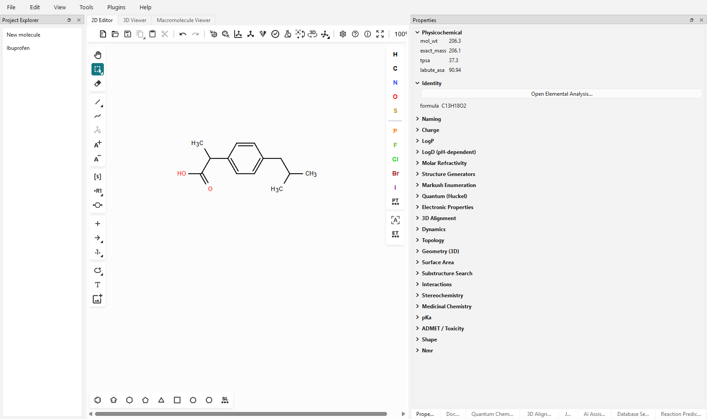
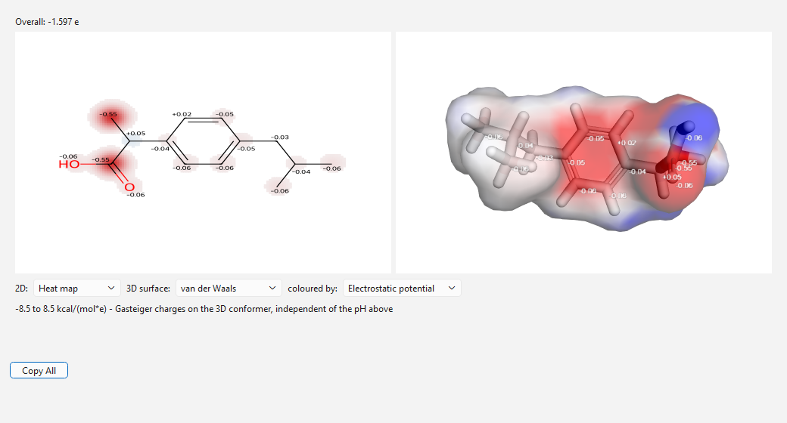
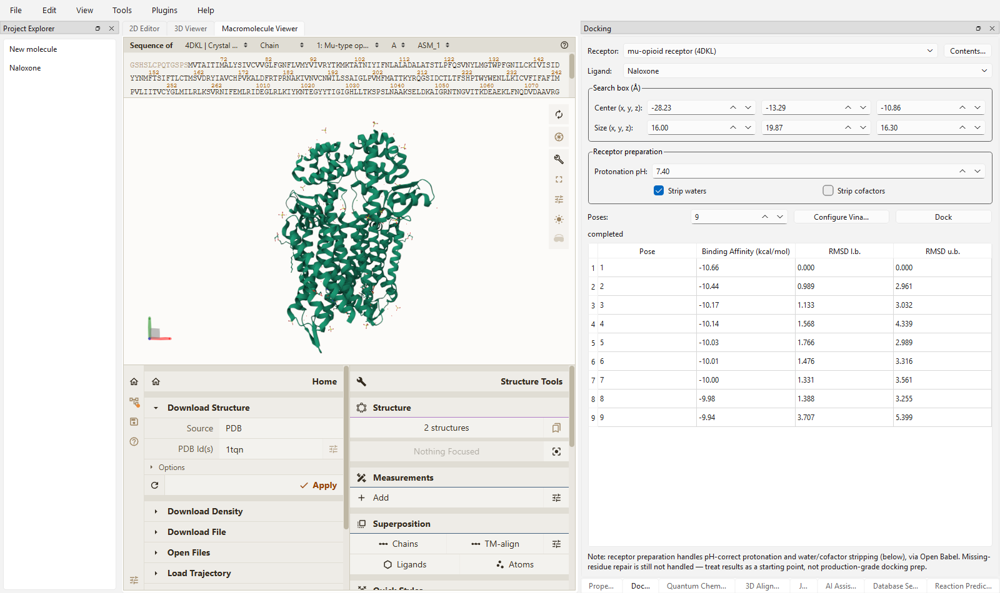
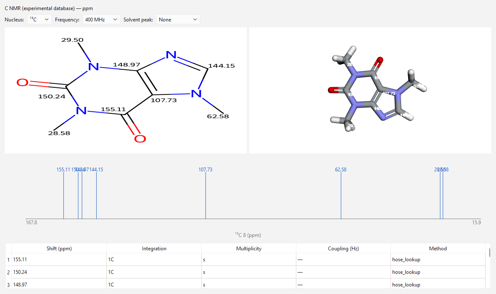
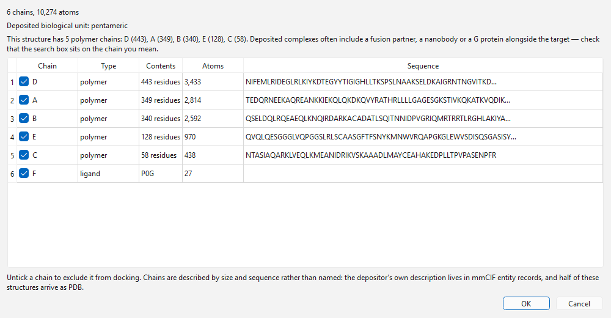

# OpenChem Studio

[](LICENSE)
[](pyproject.toml)
[](docs/QUICKSTART.md)

A desktop chemistry workbench that draws, visualises, computes, docks and
names molecules in one offline application.

It combines a 2D structure editor, two 3D viewers, 51 calculators, molecular
docking, quantum chemistry, IR and NMR prediction, batch screening over a
whole project, regulatory intelligence, and an offline IUPAC naming engine —
no account, no network, no per-seat licence. What sets it apart is
not the feature count but the standard applied to it: every number the app
reports is benchmarked against literature or a reference implementation
before it ships, and each prediction is labelled with the confidence it has
actually earned rather than presented as equally authoritative. Several
plausible features were built, measured, and deliberately **not** shipped.



| | |
|---|---|
|  |  |
| A continuous scalar field painted onto a molecular surface | Docked poses, scores and per-pose interaction analysis |
|  |  |
| Predicted ¹³C shifts on the structure, the peak spectrum and the signal table | Every chain in a deposit, before deciding what to dock against |

## Verified features

Each capability below carries the measurement behind it. Methods and sample
sizes are in [docs/VALIDATION.md](docs/VALIDATION.md).

**Offline IUPAC naming.** A vendored deterministic engine names structures
nothing has ever registered, with no model and no network. Every generated
name is parsed back with OPSIN before it is shown. **181/181** on the naming
benchmark, scored by structural round-trip rather than string equality, with
stereochemistry **11/11 and nothing silently flattened** — the best ML
alternative managed 5/11 and quietly dropped three. Known
compounds resolve against PubChem instead, and names
carry their source and whether they are `exact`, `derived` or `parsed`.

**NMR prediction, three ways.** A HOSE-code lookup over an nmrshiftdb2 index
with a *measured error per confidence band* — held-out MAE **1.12 / 3.36 /
10.00 ppm** for good / medium / rough environments across 24,280 carbons.
ORCA ab initio shielding with TMS calibration. And a hybrid that picks
per atom on measured expected error, chosen on a development split of
DELTA50 and confirmed on molecules it never saw.

**Molecular docking.** AutoDock Vina, with **49 curated receptors** carrying
binding-site boxes validated by redocking their own crystallographic ligands.
Per-pose interaction analysis, chain exclusion, and a box that refuses to run
when it contains no receptor.

**51 calculators across 24 categories** — physicochemical, topological,
geometric, surface, medicinal-chemistry, ADMET, quantum, stereochemical and
regulatory. Each is labelled `empirical` or `ab_initio` where a basis exists
to state one.

**Batch mode over a whole project**, and the analytics that need it. Any set
of calculators across every molecule, as a sortable table whose cells keep
the provenance and the empirical/ab-initio label the single-molecule views
carry — measured at **181 molecules × 63 columns in 1.7 s**. Then
correlation with the coefficient stated, deterministic PCA over the
descriptor matrix, Butina clustering, per-column distributions, and virtual
screening against the curated receptors. The correlation view is the in-app
form of the check that overturned this project's own hERG result: on a real
181-molecule set it puts molecular weight against Labute surface area at
**r = +0.984**, the same scale as the size confound it exists to catch.

**IR spectra from a calculation already being run.** ORCA's `opt_freq`
computes a full vibrational analysis and only its thermodynamic totals were
being read. Frequencies, IR intensities and normal modes now come out of the
same job, with each mode classified as a stretch, bend or torsion by
internal-coordinate decomposition — methane's five bends and four stretches,
acetone's two methyl rotors and no others. Benchmarked against NIST CCCBDB:
MAE **64.7 → 27.6 cm⁻¹** with a fitted scaling factor of **0.9666**, which
lands inside the published B3LYP band. Intensities are checked by symmetry
rather than a table, because group theory gives an exact answer: every
IR-silent band came back at **0.00**.

**Structural annotation from the naming engine.** The IUPAC engine works out
ring systems, functional groups, stereocentres and atom numbering on the way
to a name, and all of it was discarded. Now surfaced as per-atom colouring on
2D and 3D, plus a derivation tree showing how a name was built and an AI tool
that answers "why is this carbon numbered 4?" from the engine's own record
rather than from recollection.

**Regulatory intelligence.** Which frameworks have something to say about a
structure — never whether it is legal. Rules separate the regulation's
verbatim text from our machine reading of it, carry assumptions and
limitations, and explain a near miss: diisopropyl fluorophosphate reports
*has phosphoryl, P–F, O-alkyl; lacks the P–C bond*, which is the whole
distinction from a scheduled agent. A "no match" always states which rulesets
ran and how complete they are. See [benchmarks/regulatory/](benchmarks/regulatory/).

**Structure handling.** PDB, mmCIF, BinaryCIF and gzip, detected by content
rather than extension, including the deposited biological assembly rather
than only the asymmetric unit.

## What it does, and what it does not

The honest version of a comparison table: this one is about our own software.

| Does | Evidence |
|---|---|
| Deterministic offline IUPAC naming | 181/181, [benchmarks/naming/](benchmarks/naming/) |
| NMR shift prediction with per-band error | 24,280 held-out carbons |
| Docking with validated binding-site boxes | redocking across 49 receptors |
| 2D editing, 3D visualisation, macromolecules | Ketcher, 3Dmol, Mol\* |
| Plugin extension without touching the core | [docs/PLUGIN_SDK.md](docs/PLUGIN_SDK.md) |
| IR spectra with mode character | MAE 27.6 cm⁻¹ scaled, [benchmarks/ir/](benchmarks/ir/) |
| Batch screening across a project | 181 molecules × 63 columns in 1.7 s |

| Does, with stated caveats | The caveat |
|---|---|
| Electrostatic potential surfaces | two methods, side by side and labelled: point charges (instant, no ORCA) still have no lone-pair directionality or sigma holes; the ab initio surface has both, [benchmarks/esp/](benchmarks/esp/) |
| ADMET predictions | tiered Basic/Advanced/Research; accuracy is the vendor's held-out figure, not ours — the shipped model trained on all of TDC ([benchmarks/admet/](benchmarks/admet/)) |
| pKa (optional sidecar) | no solvent model |
| Molecular dynamics | vacuum, no thermostat, no solvent, no periodic boundaries |
| hERG | a risk-factor checklist, explicitly not a prediction |
| Regulatory screening | an intelligence report, NEVER a compliance determination. Ships CWC Schedule 1 only; every other domain registers empty and says so. One rule knowingly over-broad at precision 0.50, [benchmarks/regulatory/](benchmarks/regulatory/) |

| Does not | Why |
|---|---|
| ML-based naming | licence-blocked, and measurably worse than the deterministic engine |
| Solvent-dependent pKa | needs a QM/COSMO-RS-scale undertaking |
| Missing-residue repair | measured and rejected — unsafe near a binding site |
| macOS / Linux packaging | untested; source install may work, unverified |
| Continuous integration | none configured yet |

## Why this is built differently

The project's rule is that **claims are measured, not asserted** — and the
sharpest evidence for that is what is missing. Miller polarizability, HLB,
the TSEI steric index and a trained NMR shift model were each built far
enough to be measured, failed to beat what was already there or could not be
validated against a primary source, and were dropped. Each refusal is
recorded in the code where the feature would have gone, with the numbers.

The same discipline applies to what did ship. The naming benchmark has twice
overturned a conclusion reached without it. The docking receptor library
exists because redocking exposed a whole class of bug where the receptor
handed to Vina and the receptor read back by the analysis were not the same
receptor.

See [docs/SCIENTIFIC_LIMITATIONS.md](docs/SCIENTIFIC_LIMITATIONS.md) for what
each prediction can and cannot tell you.

## Install

**From a release** — Windows, no Python required, runs fully offline.
Download the zip from
[Releases](https://github.com/xaerogonzo/OpenChem-Studio/releases), unzip, run
`OpenChemStudio.exe`. Ship the whole directory; the `.exe` alone does
nothing. It is ~650 MB, almost all of it PySide6 — QtWebEngine alone is a
full Chromium, and the app hosts three web views.

**From source:**

```bash
uv sync --extra ai --extra network --extra openbabel
uv run python -m openchem.main
```

Full instructions, including the test suite and building your own
distributable, are in [docs/QUICKSTART.md](docs/QUICKSTART.md).

## Optional external tools

None are required. The app runs without all of them, and each missing tool
degrades to a clearly-labelled "not installed" state rather than an error.
All are installed from **Tools > External Tools**, into a configurable data
directory rather than into the application.

| Tool | Unlocks |
|---|---|
| AutoDock Vina | molecular docking |
| ORCA | ab initio quantum chemistry, NMR shielding, geometry optimisation |
| nmrshiftdb2 index | the HOSE-code NMR lookup and the hybrid predictor |
| pkasolver | numeric pKa, and true Henderson–Hasselbalch logD |
| ADMET-AI | hERG and CYP predictions alongside the rule-based checklist |
| Temurin JRE | OPSIN name parsing, and the naming round-trip verification |

They are deliberately not bundled: several are multi-gigabyte, individually
optional, and separately licensed.

## Documentation

Everything lives in [`docs/`](docs/):
[Quickstart](docs/QUICKSTART.md) ·
[User Guide](docs/USER_GUIDE.md) ·
[Validation](docs/VALIDATION.md) ·
[Scientific Limitations](docs/SCIENTIFIC_LIMITATIONS.md) ·
[Architecture](docs/ARCHITECTURE.md) ·
[Roadmap](docs/ROADMAP.md) ·
[Plugin SDK](docs/PLUGIN_SDK.md)

Contributions are welcome — see [CONTRIBUTING.md](CONTRIBUTING.md). It is
worth reading first, because this project has an unusual bar: a new claim
needs a measurement, and "I measured it and it was not better, so I did not
ship it" is a perfectly good outcome for a pull request.

## License

GPL-3.0-or-later — see [LICENSE](LICENSE).

The licence is GPL because the project optionally links against Open Babel's
Python bindings, which are GPL. RDKit (BSD) and PySide6 (LGPL) are both
GPL-compatible, so they do not force the choice; Open Babel does.
